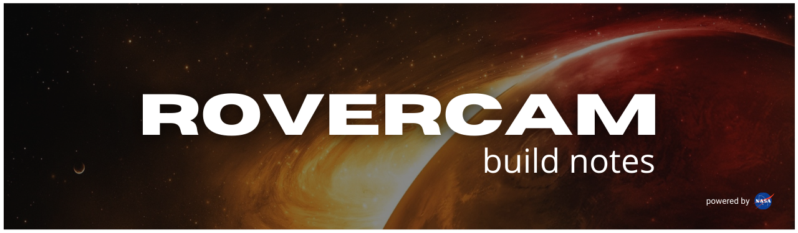
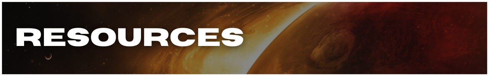
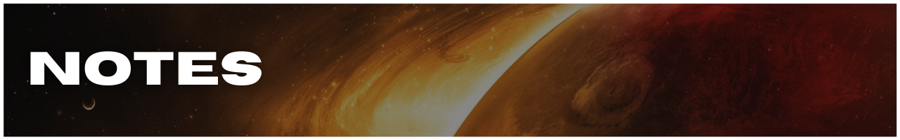
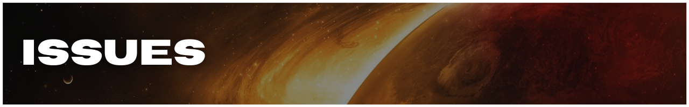
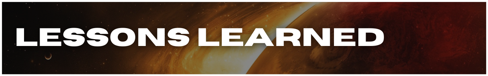
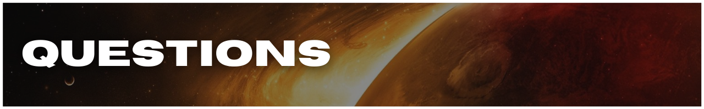

<!-- #region title -->

<div align='center'>



</div>

<div align='center'>

[Resources](#resources) | [Notes](#notes) | [Issues](#issues) | [Lessons Learned](#lessons) | [Questions](#questions) | [Connect](#connect)

</div>

<!-- #endregion /title -->

<!-- #region roadmap -->

## **ROADMAP**

### **Research**

- [ ] Mars Rover Photos API
- [ ] UX design for image-heavy apps
- [ ] UI design for image-heavy apps
- [ ] React Native image optimization best-practices
- [x] Mars img resources

### **Development**

- [ ] display images for all 4 rovers
- [ ] fetch images for all 4 rovers
- [ ] create splash screen
- [ ] set up [NASA](https://api.nasa.gov/#mars-rover-photos) Mars Rover Photos [API](https://github.com/chrisccerami/mars-photo-api) services
- [x] set up project using [Ignite](https://github.com/infinitered/ignite)

<!-- #endregion /roadmap -->

<!-- #region resources -->

<h3 id='resources' align='center'>



</h3>

<div align='center'>

[Resources](#resources) | [Notes](#notes) | [Issues](#issues) | [Lessons Learned](#lessons) | [Questions](#questions) | [Connect](#connect)

</div>

- [AXIOS](https://github.com/axios/axios#axios)
- debugging with [`react-devtools`](https://www.npmjs.com/package/react-devtools)
- Expo [docs](https://docs.expo.dev)
  - [`expo install`](https://docs.expo.dev/guides/config-plugins/#expo-install)
  - [fonts](https://docs.expo.dev/versions/latest/sdk/font/)
  - [vector icons](https://icons.expo.fyi/)
- [Ignite](https://github.com/infinitered/ignite) React Native boilerplate by [Infinite Red](infinite.red)
- NASA [Mars projects](https://mars.nasa.gov/)
- NASA [API Portal](https://api.nasa.gov/)
- [npm / yarn comparison](https://classic.yarnpkg.com/en/docs/migrating-from-npm#toc-cli-commands-comparison)
- React: [docs](reactjs.org)
  - [component lifecycles](https://projects.wojtekmaj.pl/react-lifecycle-methods-diagram/)
- React Native: [docs](reactnative.dev)
  - [fonts: x-platform](https://github.com/react-native-training/react-native-fonts)
  - [Storing Sensitive Info](https://reactnative.dev/docs/security#storing-sensitive-info)
    - [react-native-dotenv](https://github.com/goatandsheep/react-native-dotenv)
    - [react-native-config](https://github.com/luggit/react-native-config)
  - [styling](https://reactnative.dev/docs/style)
- React Navigation: [docs](https://reactnavigation.org/docs/4.x/getting-started)
  - [`createStackNavigator`](https://reactnavigation.org/docs/4.x/stack-navigator/)
  - [`createAppContainer`](https://reactnavigation.org/docs/4.x/app-containers#props-of-createappcontainer-on-react-native)
  - ['Getting Started'](https://reactnavigation.org/docs/4.x/getting-started) packages (with `expo install`):
    - [`react-navigation`](https://www.npmjs.com/package/react-navigation)
    - [`react-native-gesture-handler`](https://www.npmjs.com/package/react-native-gesture-handler)
    - [`react-native-reanimated`](https://www.npmjs.com/package/react-native-reanimated)
    - [`react-native-screens`](https://www.npmjs.com/package/react-native-screens)
  - [navigating to a new screen](https://reactnavigation.org/docs/4.x/navigating#navigating-to-a-new-screen)
  - [route configs](https://reactnavigation.org/docs/4.x/stack-navigator#routeconfigs)
- Shopify's React Native [styling workflow](https://shopify.engineering/5-ways-to-improve-your-react-native-styling-workflow)

<!-- #endregion /resources -->

<!-- #region notes -->

<h3 id='notes' align='center'>



</h3>

<div align='center'>

[Resources](#resources) | [Notes](#notes) | [Issues](#issues) | [Lessons Learned](#lessons) | [Questions](#questions) | [Connect](#connect)

</div>

<!-- #endregion /notes -->

<!-- #region issues -->

<h3 id='issues' align='center'>



</h3>

<div align='center'>

[Resources](#resources) | [Notes](#notes) | [Issues](#issues) | [Lessons Learned](#lessons) | [Questions](#questions) | [Connect](#connect)

</div>

<!-- #region [unable to resolve module (fs)] -->

## **_PROBLEM_**

```reactnative
Unable to resolve module fs from /Users/eph/_repos/m-spacer/node_modules/dotenv/lib/main.js: fs could not be found within the project or in these directories: node_modules
```

## **_CAUSE_**

- _`fs` doesn't exist in React Native ( deep-dive )_

## **_SOUTION_**

- route 3rd-party API calls through server where keys/secrets are stored (prevents sensitive info getting jacked in transit)

- React Native pgks for handling config/environment variables:
  - [rovercam readme graphic](https://github.com/goatandsheep/react-native-dotenv) | [react-native-config](https://github.com/luggit/react-native-config)

<!-- #endregion /*unable to resolve module (fs)* -->
<!-- #region [unable to resolve module (removed comment top of file)] -->

<details>
<summary>Unable to resolve (deleted comment top of file) in <code>node_modules</code></summary>

## **_PROBLEM:_**

```reactnative
Unable to resolve module from <path>: could not be found within the project or in these directories: node_modules
```

## **_CAUSE:_**

I added a comment at top of file. Attempted:

[ ] deleting comment
[ ] restarting app
[ ] reset Metro cache via `yarn start --reset-cach` per error message \* returns `error: unknown option --reset-cache`

**_Actual Cause:_**

incomplete `<ImageBackground>` source path. awesome.

## **_SOLUTION:_**

add img file name to `<ImageBackground source={require('')}>`. awesome.

</details>

<!-- #endregion /[unable to resolve module (removed comment top of file)] -->

<!-- #endregion /issues -->

<!-- #region lessons learned -->

<h3 id='lessons' align='center'>



</h3>

<div align='center'>

[Resources](#resources) | [Notes](#notes) | [Issues](#issues) | [Lessons Learned](#lessons) | [Questions](#questions) | [Connect](#connect)

</div>

<!-- #endregion /lessons learned -->

<!-- #region questions -->

<h3 id='questions' align='center'>



</h3>

<div align='center'>

[Resources](#resources) | [Notes](#notes) | [Issues](#issues) | [Lessons Learned](#lessons) | [Questions](#questions) | [Connect](#connect)

</div>

<!-- #endregion /questions -->

<!-- #region connect -->

<h3 id='connect' align='center'>


</h3>

<div align='center'>

[Resources](#resources) | [Notes](#notes) | [Issues](#issues) | [Lessons Learned](#lessons) | [Questions](#questions) | [Connect](#connect)

</div>

<!-- #endregion /connect -->
