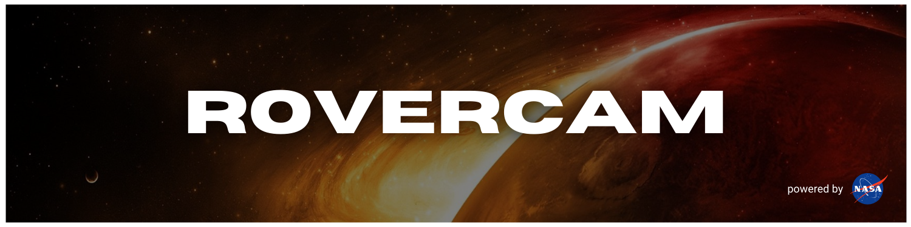

## **OBJECTIVE**

1. get familiar with [Infinite Red](https://infinite.red/)'s React Native [Ignite](https://github.com/infinitered/ignite) boilerplate ( vExpo )
2. learn React Native project setup best-practices & design patterns
3. earn _cool_ points with my kids for "working with robots" ( they're 5 & 3. I'm not correcting them.. )


This isn't _everything_...

### **_Research_**

- [ ] Mars Rover Photos API
- [ ] UX design for image-heavy apps
- [ ] UI design for image-heavy apps
- [ ] React Native image optimization best-practices
- [x] Mars img resources

### **_Development_**

- [ ] display images for all 4 rovers
- [ ] fetch images for all 4 rovers
- [ ] create splash screen
- [ ] set up [NASA](https://api.nasa.gov/#mars-rover-photos) Mars Rover Photos [API](https://github.com/chrisccerami/mars-photo-api) services
- [x] set up project using [Ignite](https://github.com/infinitered/ignite)


<details>
<summary><code>dotenv</code> | unable to resolve module <code>'fs'</code></summary>

### **_PROBLEM_**

```reactnative
Unable to resolve module fs from /Users/eph/_repos/m-spacer/node_modules/dotenv/lib/main.js: fs could not be found within the project or in these directories: node_modules
```

### **_CAUSE_**

- _`fs` doesn't exist in React Native ( deep-dive )_

### **_SOUTION_**

- route 3rd-party API calls through server where keys/secrets are stored (prevents sensitive info getting jacked in transit)

- React Native pgks for handling config/environment variables:
  - [react-native-dotenv](https://github.com/goatandsheep/react-native-dotenv) | [react-native-config](https://github.com/luggit/react-native-config)

</details>


<details>
<summary>Data Fetching</summary>

- [AXIOS](https://github.com/axios/axios#axios)

</details>

<details>
<summary>Design Patterns</summary>

- Shopify's React Native [styling workflow](https://shopify.engineering/5-ways-to-improve-your-react-native-styling-workflow)

</details>

<details>
<summary>NASA / Space</summary>

- NASA [API Portal](https://api.nasa.gov/)

- [mars.nasa.gov](https://mars.nasa.gov/)

</details>

<details>
<summary>React / React Native</summary>

- [stack navigator](https://reactnavigation.org/docs/4.x/hello-react-navigation#creating-a-stack-navigator)
- [vector icons](https://icons.expo.fyi/)
- [styling](https://reactnative.dev/docs/style)
- [component lifecycles](https://projects.wojtekmaj.pl/react-lifecycle-methods-diagram/)
- [Storing Sensitive Info](https://reactnative.dev/docs/security#storing-sensitive-info)
  - [react-native-dotenv](https://github.com/goatandsheep/react-native-dotenv)
  - [react-native-config](https://github.com/luggit/react-native-config)

</details>

<details>
<summary>Tooling</summary>

- Infinite Red | [Ignite](https://github.com/infinitered/ignite) React Native boilerplate
- [npm / yarn comparison](https://classic.yarnpkg.com/en/docs/migrating-from-npm#toc-cli-commands-comparison)

</details>


## **Chris Cerami**

_Maintains the [Mars Rover Photo API](https://github.com/chrisccerami/mars-photo-api)_

[](https://github.com/chrisccerami)
[](https://twitter.com/chrisccerami)


- [Email](mailto:github@modevx.com)
- [ephraimsmith.dev](https://ephraimsmith.dev)
- [GitHub](https://github.com/ephraimsmithdev)
- [Instagram](https://instagram.com/ephraimsmithdev)
- [LinkedIn](https://linkedin.com/in/ephraimsmithdev)
- [Twitter](https://twitter.com/ephraimsmithdev)
