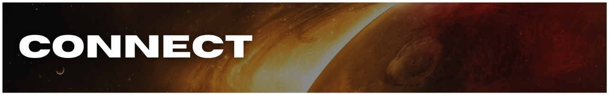

[Install & Run](#install) | [How To Use](#use) | [Shout-Outs](#shout-outs) | [License](#license) | [Contribute](#contribute) | [Connect](#connect)

**_:bangbang: Check out [`BUILD_NOTES.md`](https://github.com/ephraimsmithdev/alstr/blob/prod/BUILD_NOTES.md) for project timeline, progress, resources, notes, issues, & more!_**

## **_FEATURES_**

### **MVP**

- [ ] search by SOL
- [ ] search by EARTH DATE
- [ ] search by ROVER/CAM
- [ ] see latest photos for each Rover

### **Future**

- [ ] rate images (create fan-favorite collections)

<h3 id='install' align='center'>

</h3>

[Install & Run](#install) | [How To Use](#use) | [Shout-Outs](#shout-outs) | [License](#license) | [Contribute](#contribute) | [Connect](#connect)

**_...just a sec..._**

<h3 id='use' align='center'>

</h3>

[Install & Run](#install) | [How To Use](#use) | [Shout-Outs](#shout-outs) | [License](#license) | [Contribute](#contribute) | [Connect](#connect)

<h3 id='shout-outs' align='center'>

</h3>

[Install & Run](#install) | [How To Use](#use) | [Shout-Outs](#shout-outs) | [License](#license) | [Contribute](#contribute) | [Connect](#connect)

## **_Chris Cerami_**

_Maintains the [Mars Rover Photo API](https://github.com/chrisccerami/mars-photo-api)_

<h3 id='license' align='center'>

</h3>

[Install & Run](#install) | [How To Use](#use) | [Shout-Outs](#shout-outs) | [License](#license) | [Contribute](#contribute) | [Connect](#connect)

<h3 id='contribute' align='center'>

</h3>

[Install & Run](#install) | [How To Use](#use) | [Shout-Outs](#shout-outs) | [License](#license) | [Contribute](#contribute) | [Connect](#connect)

<h3 id='connect' align='center'>

</h3>

[Install & Run](#install) | [How To Use](#use) | [Shout-Outs](#shout-outs) | [License](#license) | [Contribute](#contribute) | [Connect](#connect)

- [Email](mailto:github@modevx.com)
- [ephraimsmith.dev](https://ephraimsmith.dev)
- [GitHub](https://github.com/ephraimsmithdev)
- [Instagram](https://instagram.com/ephraimsmithdev)
- [LinkedIn](https://linkedin.com/in/ephraimsmithdev)
- [Twitter](https://twitter.com/ephraimsmithdev)
